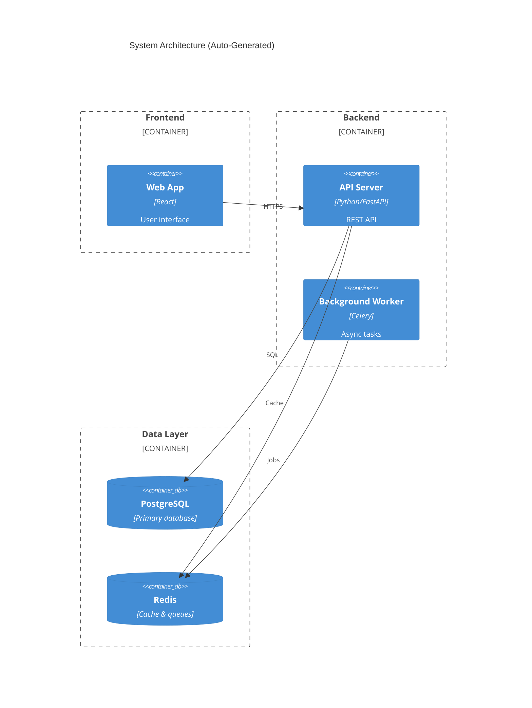
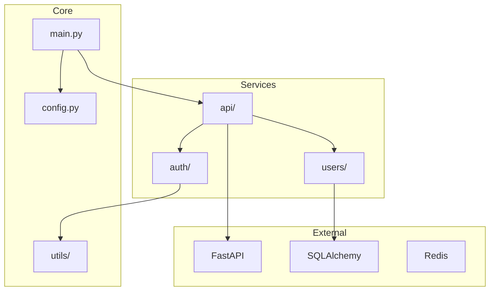
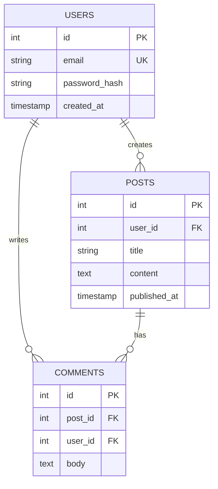

# Diagram Scanner - Auto-Generate from Codebase

Automatically generate architecture and relationship diagrams by scanning the codebase.

## Instructions

When invoked, analyze the codebase to generate appropriate diagrams:

1. **Parse flags** - Check for scan mode:
   - `--architecture` / `-a` - Generate system architecture diagram
   - `--dependencies` / `-d` - Generate dependency graph
   - `--classes` / `-c` - Generate class/module diagram
   - `--calls` / `-f` - Generate call flow diagram
   - `--database` / `-db` - Generate database schema diagram
   - `--api` / `-api` - Generate API endpoint diagram
   - `--all` - Generate all applicable diagrams

   Additional options:
   - `--path <dir>` - Scan specific directory (default: entire repo)
   - `--output <format>` - mermaid (default), d2, or plantuml

2. **Scan the codebase** using these strategies:

### Architecture Scan (`--architecture`)
```python
# Look for:
# - Directory structure → component boundaries
# - Import patterns → dependencies
# - Config files (docker-compose, k8s) → infrastructure
# - Package.json, pyproject.toml → services
# - .env files → external services

# Generate C4 Container or block diagram showing:
# - Main components/services
# - Databases and storage
# - External integrations
# - Communication patterns
```

### Dependency Scan (`--dependencies`)
```python
# Analyze:
# - Python: imports, requirements.txt, pyproject.toml
# - JavaScript: import/require, package.json
# - Go: imports, go.mod
# - Rust: use statements, Cargo.toml

# Generate flowchart showing:
# - Internal module dependencies
# - External package dependencies
# - Circular dependency warnings
```

### Class/Module Scan (`--classes`)
```python
# Parse:
# - Class definitions and inheritance
# - Method signatures
# - Type annotations
# - Dataclasses/models

# Generate classDiagram or D2 with:
# - Classes and their attributes
# - Inheritance relationships
# - Composition/aggregation
# - Key methods
```

### Call Flow Scan (`--calls`)
```python
# Trace entry points and generate sequence diagrams for:
# - API endpoints → handlers → services → repos
# - CLI commands → subcommands → functions
# - Event handlers → processors → outputs

# Focus on:
# - Main execution paths
# - Error handling branches
# - Async/await patterns
```

### Database Schema Scan (`--database`)
```python
# Parse:
# - ORM models (SQLAlchemy, Django, Prisma)
# - Migration files
# - Schema files (SQL, GraphQL)

# Generate erDiagram showing:
# - Tables/entities
# - Columns and types
# - Primary/foreign keys
# - Relationships (1:1, 1:N, N:M)
```

### API Endpoint Scan (`--api`)
```python
# Parse:
# - Route definitions (Flask, FastAPI, Express)
# - OpenAPI/Swagger specs
# - GraphQL schemas
# - REST patterns in code

# Generate flowchart showing:
# - Endpoint groups
# - HTTP methods
# - Request/response flows
# - Authentication requirements
```

3. **Generate diagram source** - Based on scan results

4. **Save and render** - Write to `diagrams/scan-<type>-<timestamp>.mmd` (or .d2)

5. **Show results** - Display generated diagram with summary of what was found

## Scan Output Examples

### Architecture Output


### Dependency Output


### Database Schema Output


## Example Usage

**Scan entire repo for architecture:**
```
/diagram-scan --architecture
```

**Generate class diagram for specific path:**
```
/diagram-scan --classes --path src/models
```

**Full scan with all diagram types:**
```
/diagram-scan --all
```

**Generate D2 output:**
```
/diagram-scan --architecture --output d2
```

## Arguments

$ARGUMENTS - Scan flags:
- `--architecture` / `-a` - System architecture
- `--dependencies` / `-d` - Dependency graph
- `--classes` / `-c` - Class/module diagram
- `--calls` / `-f` - Call flow diagram
- `--database` / `-db` - Database schema
- `--api` / `-api` - API endpoints
- `--all` - All applicable diagrams
- `--path <dir>` - Specific directory
- `--output <format>` - mermaid, d2, or plantuml
