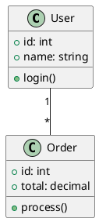

# Kroki Universal Diagram Generator

Generate diagrams using Kroki API - supports 20+ diagram languages through a unified interface.

## Why Kroki?

Kroki is a unified API that renders diagrams from many formats:
- No local installation needed for exotic formats
- Consistent output quality
- Supports formats not available locally

## Supported Diagram Types

| Type | Best For |
|------|----------|
| `mermaid` | Flowcharts, sequence, ER, state |
| `plantuml` | UML (class, sequence, activity, component) |
| `graphviz` | Complex graph layouts |
| `d2` | Modern declarative diagrams |
| `structurizr` | C4 architecture diagrams |
| `excalidraw` | Hand-drawn style |
| `pikchr` | Technical documentation diagrams |
| `bytefield` | Protocol/binary format diagrams |
| `wavedrom` | Digital timing diagrams |
| `vega` | Data visualizations |
| `vegalite` | Simplified data viz |
| `nomnoml` | UML-like diagrams |
| `erd` | Entity-relationship diagrams |
| `ditaa` | ASCII art to diagrams |
| `blockdiag` | Block diagrams |
| `seqdiag` | Sequence diagrams |
| `actdiag` | Activity diagrams |
| `nwdiag` | Network diagrams |
| `packetdiag` | Packet format diagrams |
| `rackdiag` | Rack diagrams |
| `bpmn` | Business process diagrams |
| `svgbob` | ASCII to SVG |
| `umlet` | UML diagrams |
| `symbolator` | HDL symbol diagrams |

## Instructions

When the user provides a description, follow these steps:

1. **Parse flags** - Check for:
   - `--type <format>` - Diagram type (default: auto-detect or mermaid)
   - `--format <output>` - Output format: png (default), svg, pdf

2. **Determine diagram type** - Based on description or explicit flag

3. **Generate diagram source** - Create valid syntax for chosen type

4. **Save source file** - Write to `diagrams/<name>.<ext>` with appropriate extension

5. **Render via Kroki API** - Use this Python code:

```python
import base64
import zlib
import requests
import os

def render_kroki(source: str, diagram_type: str, output_format: str = "png") -> bytes:
    """Render diagram using Kroki API."""
    # Compress and encode
    compressed = zlib.compress(source.encode('utf-8'), 9)
    encoded = base64.urlsafe_b64encode(compressed).decode('ascii')

    # Call Kroki API
    url = f"https://kroki.io/{diagram_type}/{output_format}/{encoded}"
    response = requests.get(url, timeout=30)
    response.raise_for_status()
    return response.content

def save_diagram(source: str, diagram_type: str, name: str, output_dir: str = "diagrams", output_format: str = "png"):
    """Generate and save diagram."""
    os.makedirs(output_dir, exist_ok=True)
    content = render_kroki(source, diagram_type, output_format)
    output_path = os.path.join(output_dir, f"{name}.{output_format}")
    with open(output_path, 'wb') as f:
        f.write(content)
    return output_path
```

6. **Show the result** - Display the generated diagram

## Format-Specific Examples

### PlantUML (UML diagrams)


### Structurizr (C4 diagrams)
```structurizr
workspace {
    model {
        user = person "User"
        system = softwareSystem "System" {
            webapp = container "Web App"
            api = container "API"
            db = container "Database"
        }
        user -> webapp "Uses"
        webapp -> api "Calls"
        api -> db "Reads/Writes"
    }
    views {
        container system {
            include *
            autoLayout
        }
    }
}
```

### Bytefield (Protocol diagrams)
```bytefield
(defattrs :bg-green {:fill "#a0ffa0"})
(defattrs :bg-yellow {:fill "#ffffa0"})

(draw-column-headers)

(draw-box "Magic" [:bg-green {:span 4}])
(draw-box "Version" [:bg-yellow])
(draw-box "Type" [:bg-yellow])
(draw-box "Length" {:span 2})
(draw-box "Data" {:span 8})
```

### WaveDrom (Digital timing)
```wavedrom
{ signal: [
  { name: "clk",  wave: "p.....|..." },
  { name: "data", wave: "x.345x|=.x", data: ["a", "b", "c", "d"] },
  { name: "req",  wave: "0.1..0|1.0" },
  { name: "ack",  wave: "1.....|01." }
]}
```

### ERD (Entity-relationship)
```erd
[Person]
*name
height
weight
+birth_location_id

[Location]
*id
city
state
country

Person *--1 Location
```

### BPMN (Business process)
```bpmn
<?xml version="1.0" encoding="UTF-8"?>
<definitions xmlns="http://www.omg.org/spec/BPMN/20100524/MODEL">
  <process id="simple" isExecutable="true">
    <startEvent id="start"/>
    <task id="task1" name="Do Something"/>
    <endEvent id="end"/>
    <sequenceFlow sourceRef="start" targetRef="task1"/>
    <sequenceFlow sourceRef="task1" targetRef="end"/>
  </process>
</definitions>
```

### Ditaa (ASCII art)
```ditaa
    +--------+   +-------+    +-------+
    |        |   |       |    |       |
    | Client +-->| Proxy +--->+ Server|
    |        |   |       |    |       |
    +--------+   +-------+    +-------+
```

## Output Location

All diagrams are saved to: `diagrams/` in the repo root

## Example Usage

**PlantUML class diagram:**
```
/kroki --type plantuml Create a UML class diagram for an e-commerce system
```

**Protocol/packet format:**
```
/kroki --type bytefield Create a TCP header packet diagram
```

**Business process:**
```
/kroki --type bpmn Create a BPMN diagram for order fulfillment
```

**C4 architecture:**
```
/kroki --type structurizr Create a C4 container diagram for a microservices system
```

## Arguments

$ARGUMENTS - The diagram description with optional flags:
- `--type <format>` - Diagram type (plantuml, structurizr, bytefield, wavedrom, etc.)
- `--format <output>` - Output format: png (default), svg, pdf
