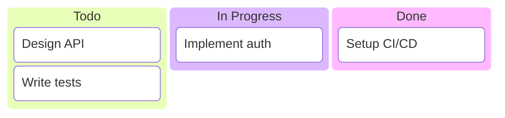
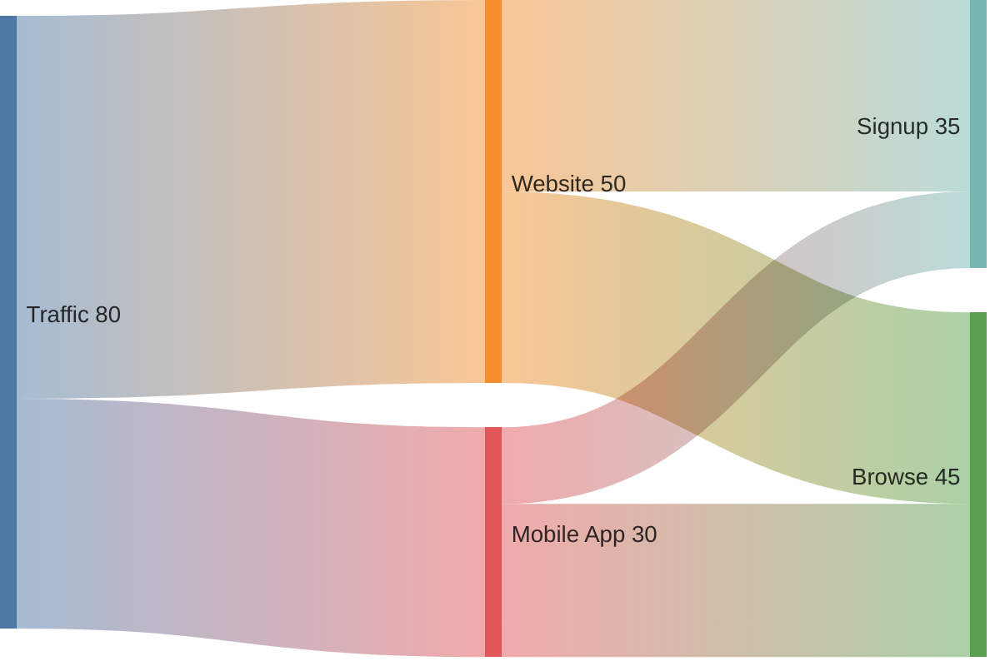
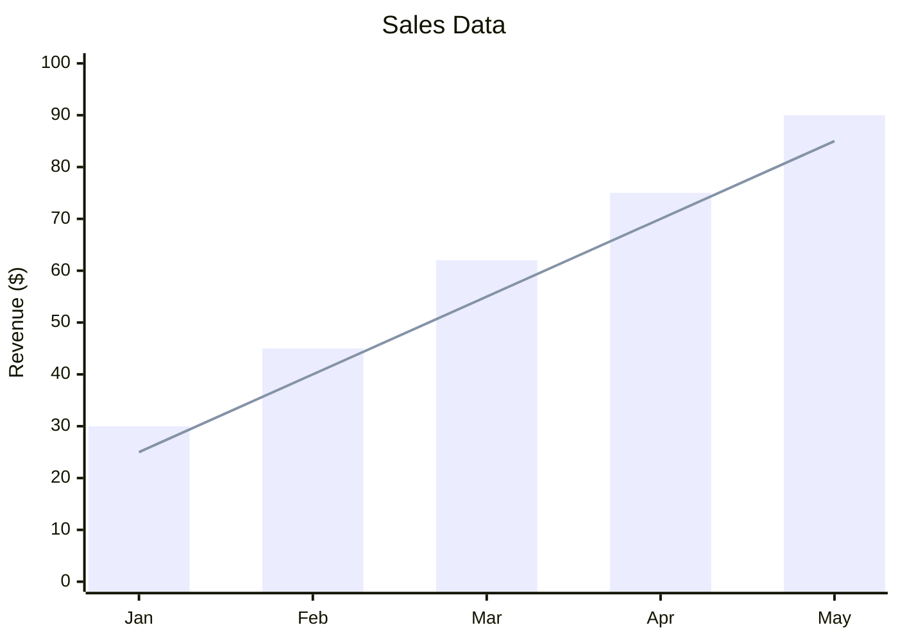
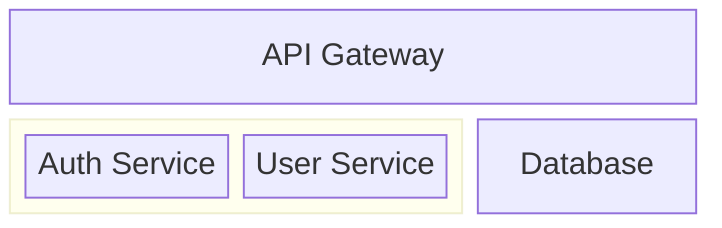

# Mermaid Diagram Generator

Generate Mermaid diagrams from natural language descriptions.

## Instructions

When the user provides a description, follow these steps:

1. **Parse flags** - Check for optional style flags:
   - `--sketch` or `-s` - Hand-drawn style (look: handDrawn)
   - `--neo` or `-n` - Modern neo theme
   - `--dark` or `-d` - Dark theme (default)
   - `--light` or `-l` - Light theme

2. **Analyze the request** - Determine the best diagram type:

   **Classic Types:**
   - `flowchart` - Process flows, decision trees, workflows
   - `sequenceDiagram` - Interactions between systems/actors over time
   - `classDiagram` - Object structures, relationships
   - `stateDiagram-v2` - State machines, lifecycle diagrams
   - `erDiagram` - Entity-relationship, data models
   - `C4Context` / `C4Container` - Architecture diagrams (C4 model)
   - `mindmap` - Hierarchical concepts
   - `timeline` - Chronological events
   - `gitGraph` - Git branch visualization
   - `pie` - Pie charts
   - `quadrantChart` - Four-quadrant analysis

   **Mermaid v11 New Types:**
   - `kanban` - Kanban task boards with columns and cards
   - `sankey-beta` - Flow/volume visualization (Sankey diagrams)
   - `xychart-beta` - Data plots (line, bar, scatter)
   - `block-beta` - Custom block/grid layouts
   - `packet-beta` - Network packet diagrams
   - `architecture-beta` - Cloud architecture diagrams

   **For radar/capability charts:** Use quadrantChart or xychart-beta

3. **Generate Mermaid syntax** - Create valid Mermaid code based on the description

   **Apply theme/style configuration** at the top of the .mmd file:

   For `--sketch` (hand-drawn style):
   ```
   %%{init: {'look': 'handDrawn', 'theme': 'default'}}%%
   ```

   For `--neo` (modern neo theme):
   ```
   %%{init: {'theme': 'neo'}}%%
   ```

   For `--dark` (dark theme - default):
   ```
   %%{init: {'theme': 'dark'}}%%
   ```

   For `--light` (light theme):
   ```
   %%{init: {'theme': 'default'}}%%
   ```

4. **Save the .mmd file** - Write to `diagrams/<descriptive-name>.mmd`

5. **Render to PNG** - Run:
   ```bash
   mmdc -i diagrams/<name>.mmd -o diagrams/<name>.png -b transparent -s 3
   ```

6. **Show the result** - Display the generated diagram to the user

## Output Location

All diagrams are saved to: `diagrams/` in the repo root

## Example Usage

User: "Create a flowchart showing user login with MFA"

Response:
1. Create `diagrams/user-login-mfa.mmd` with flowchart syntax
2. Render to `diagrams/user-login-mfa.png`
3. Show the diagram

## Diagram Conventions

- Use descriptive node IDs (e.g., `userInput` not `A`)
- Include clear labels on all connections
- Use subgraphs for logical grouping
- Keep diagrams focused - suggest splitting if too complex

## New Diagram Type Examples

### Kanban Board


### Sankey Diagram


### XY Chart


### Block Diagram


## Arguments

$ARGUMENTS - The diagram description with optional flags:
- `--sketch` / `-s` - Hand-drawn aesthetic
- `--neo` / `-n` - Modern neo theme
- `--dark` / `-d` - Dark theme (default)
- `--light` / `-l` - Light theme
