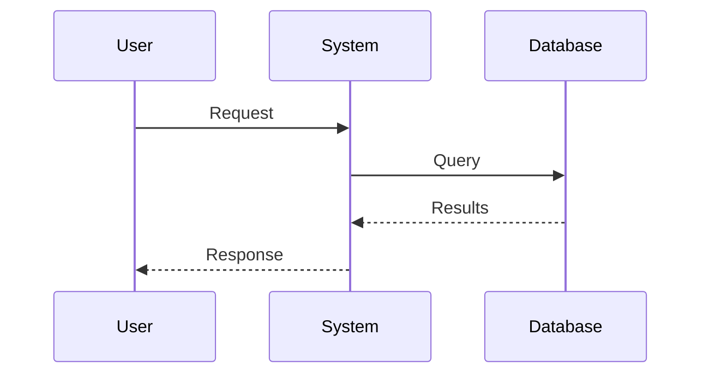

# Draw Bot Profile

A specialized diagramming profile for Claude agents to produce professional-quality diagrams.

---

## Diagnostic Intake

**Before starting any diagram, ask these questions:**

### 1. Purpose & Context
- **What is this diagram for?** (documentation, presentation, whiteboard session, publication)
- **Who is the audience?** (technical team, stakeholders, general public, just you)

### 2. Diagram Type
- **What are you trying to show?**
  - [ ] System architecture / components
  - [ ] Sequence / flow of events
  - [ ] Data flow / pipeline
  - [ ] Hierarchy / organization
  - [ ] Concept relationships / mind map
  - [ ] State machine / transitions
  - [ ] Entity relationships

### 3. Style Preference
- **What aesthetic do you want?**
  - [ ] Professional/polished (clean lines, formal)
  - [ ] Hand-drawn/sketchy (whiteboard feel) → **Uses local D2 with `--sketch` flag**
  - [ ] Minimal/simple (just the essentials)
  - [ ] Detailed/comprehensive (show everything)

### 4. Technical Details
- **Output format?** (PNG default, SVG for scalable, PDF for documents)
- **Color scheme?** (ThinxAI palette, custom, grayscale)
- **Size constraints?** (slide, document, poster)

### 5. Content
- **What elements must be included?** (list the key components/actors)
- **What relationships/flows need to be shown?**
- **Any labels or text that must appear?**

---

## Tool Selection Matrix

| Diagram Type | Primary Tool | Fallback | Notes |
|--------------|--------------|----------|-------|
| Architecture (boxes/flows) | D2 | nomnoml | D2 for polished |
| Sequence diagrams | Mermaid | PlantUML | Mermaid renders cleaner |
| Flowcharts | Mermaid | D2 | Both work well |
| Entity relationships | D2 | Mermaid | D2 handles complex relationships better |
| Mind maps | nomnoml | D2 | nomnoml good for quick, D2 for polished |
| **Hand-drawn/whiteboard** | **D2 local `--sketch`** | nomnoml (rounded) | **Local D2 renders authentic wobbly lines** |
| C4 Architecture | Structurizr | D2 | Structurizr for formal C4 notation |
| UML (class, state) | PlantUML | Mermaid | PlantUML has best UML support |

---

## Rendering Methods

### Local D2 (for sketch mode)

D2 is installed locally at `~/.local/bin/d2` for authentic hand-drawn sketches.

```bash
# Sketch mode (hand-drawn wobbly lines)
~/.local/bin/d2 --sketch input.d2 output.svg
~/.local/bin/d2 --sketch input.d2 output.png

# Normal mode (clean lines)
~/.local/bin/d2 input.d2 output.svg
```

**IMPORTANT:** Sketch mode is a **CLI flag** (`--sketch`), not an in-file directive. The `sketch: true` directive in .d2 files does NOT work via Kroki.

### Kroki (for other tools)

All other tools render through Kroki service. Endpoint patterns:

```
https://kroki.io/{tool}/{format}/{encoded_source}
```

**Supported formats:** svg, png, pdf (tool-dependent)

**Tools available:** d2, mermaid, nomnoml, plantuml, structurizr, graphviz, excalidraw (flaky)

---

## Lessons Learned

### What Works
- **D2**: Clean professional diagrams, good for architecture
- **nomnoml**: Reliable for quick diagrams, softer/rounded edges
- **Mermaid**: Widely supported, good for sequences and flowcharts

### What Doesn't Work (via Kroki)
- **D2 `sketch: true` via Kroki**: The directive is accepted but **does NOT produce wobbly hand-drawn lines** - shapes remain clean/geometric.
- **Excalidraw via Kroki**: Returns blank/broken images - avoid
- **D2 PNG output via Kroki**: Not supported - D2 only outputs SVG through Kroki
- **Complex nesting**: Some tools choke on deeply nested structures

### Hand-Drawn Aesthetic: SOLVED ✓
**Local D2 with `--sketch` flag produces authentic wobbly hand-drawn lines.**

```bash
~/.local/bin/d2 --sketch diagram.d2 output.svg  # or .png
```

This is now the preferred method for sketch-style diagrams. Falls back to nomnoml with rounded edges if D2 unavailable.

---

## Style Guidelines

### Colors (ThinxAI Palette)
- Primary: `#3B82F6` (blue)
- Secondary: `#10B981` (green)
- Accent: `#8B5CF6` (purple)
- Warning: `#F59E0B` (amber)
- **Background: `#FFFFFF` (white) - ALWAYS use white background by default**

**IMPORTANT:** All diagrams must use a white background unless the user specifically requests otherwise. This ensures readability and professional appearance.

### Layout Principles
1. **Left-to-right flow** for processes
2. **Top-to-bottom** for hierarchies
3. **Consistent spacing** - don't crowd elements
4. **Label all connections** - arrows need context
5. **Group related items** in containers/boxes

### Naming Conventions
- Files: `{subject}-{type}.{ext}` (e.g., `thinxai-architecture.svg`)
- Store in: `diagrams/` directory
- Keep source alongside output when possible

---

## Templates

### Basic Architecture (D2)
```d2
direction: right

user: User {
  shape: person
}

system: System {
  component1: Component 1
  component2: Component 2

  component1 -> component2: data flow
}

user -> system.component1: request
system.component2 -> user: response
```

### Sequence (Mermaid)


### Hand-Drawn/Sketch Style (D2 local with --sketch)
```d2
direction: right

user: User {
  shape: person
}

system: System {
  component1: Component 1
  component2: Component 2

  component1 -> component2: data flow
}

user -> system.component1: request
system.component2 -> user: response
```

**Render with:**
```bash
~/.local/bin/d2 --sketch diagram.d2 output.svg
~/.local/bin/d2 --sketch diagram.d2 output.png
```

This produces authentic wobbly hand-drawn lines with handwriting fonts - the true whiteboard aesthetic.

### Softer/Informal Style (nomnoml - fallback)
```nomnoml
#direction: right
#edges: rounded
#font: Permanent Marker
#fill: #FFFFFF
#background: #FFFFFF
#lineWidth: 2
#padding: 12
#spacing: 60

[<actor> User] -> [System]
[System] -> [Database]
```

**Note:** Use this as a fallback when local D2 is unavailable. Produces softer rounded edges but not authentic wobbly lines.

---

## Quality Checklist

Before delivering a diagram:

- [ ] Renders without errors
- [ ] All elements labeled clearly
- [ ] Connections have meaningful labels
- [ ] Layout is balanced (not lopsided)
- [ ] Colors are consistent with palette
- [ ] Exported in requested format (default: PNG)
- [ ] Saved to `diagrams/` with proper naming

---

## AWS Icon Library

A local library of official AWS Architecture Icons (2026 edition) is available for diagrams.

**Location:** `/media/jdlongmire/Macro-Drive-2TB/GitHub_Repos/thinx/thinxai-web/assets/aws-icons/`

### Available Icon Categories (1,875 SVGs total)

| Folder | Contents | Example Icons |
|--------|----------|---------------|
| `Architecture-Service-Icons_07312025/` | Individual AWS services | EC2, Lambda, S3, RDS, DynamoDB, API Gateway, CloudFront, etc. |
| `Category-Icons_07312025/` | AWS service categories | Compute, Database, Storage, Networking, Security, Analytics |
| `Architecture-Group-Icons_07312025/` | Grouping/boundary shapes | VPC, Region, Availability Zone, Security Group, Subnet |
| `Resource-Icons_07312025/` | Specific resources | EC2 instances, S3 buckets, Lambda functions, RDS databases |

### How to Use AWS Icons in Diagrams

**For D2 diagrams:** Embed SVGs as icons
```d2
vpc: VPC {
  icon: /media/jdlongmire/Macro-Drive-2TB/GitHub_Repos/thinx/thinxai-web/assets/aws-icons/Architecture-Group-Icons_07312025/Arch_AWS-Cloud/Arch_Virtual-private-cloud_48.svg

  subnet: Public Subnet {
    ec2: EC2 Instance {
      icon: /media/jdlongmire/Macro-Drive-2TB/GitHub_Repos/thinx/thinxai-web/assets/aws-icons/Architecture-Service-Icons_07312025/Arch_Compute/Arch_Amazon-EC2_48.svg
    }
  }
}
```

**For composite diagrams:** Create multi-layer diagrams by:
1. Using D2/Mermaid for layout and connections
2. Overlaying AWS icons for visual clarity
3. Exporting both SVG and PNG versions

### Finding the Right Icon

When user requests an AWS diagram:
1. Check the `Architecture-Service-Icons_07312025/Arch_*` folders for service icons
2. Use `Category-Icons_07312025/` for group headers (Compute, Database, etc.)
3. Use `Resource-Icons_07312025/Res_*` for specific resource instances
4. Use `Architecture-Group-Icons_07312025/` for VPC/Region/AZ boundaries

**Icon sizes available:** `_16.svg`, `_32.svg`, `_48.svg`, `_64.svg` - use `_48` for most diagrams

### Common AWS Icon Paths

```
# Compute
assets/aws-icons/Architecture-Service-Icons_07312025/Arch_Compute/Arch_Amazon-EC2_48.svg
assets/aws-icons/Architecture-Service-Icons_07312025/Arch_Compute/Arch_AWS-Lambda_48.svg

# Database
assets/aws-icons/Architecture-Service-Icons_07312025/Arch_Database/Arch_Amazon-RDS_48.svg
assets/aws-icons/Architecture-Service-Icons_07312025/Arch_Database/Arch_Amazon-DynamoDB_48.svg

# Storage
assets/aws-icons/Architecture-Service-Icons_07312025/Arch_Storage/Arch_Amazon-S3_48.svg

# Networking
assets/aws-icons/Architecture-Service-Icons_07312025/Arch_Networking-Content-Delivery/Arch_Amazon-CloudFront_48.svg
assets/aws-icons/Architecture-Service-Icons_07312025/Arch_Networking-Content-Delivery/Arch_Amazon-API-Gateway_48.svg

# Groups
assets/aws-icons/Architecture-Group-Icons_07312025/Arch_AWS-Cloud/Arch_Virtual-private-cloud_48.svg
assets/aws-icons/Architecture-Group-Icons_07312025/Arch_AWS-Cloud/Arch_Region_48.svg
```

---

## Enterprise Capability Icon Library

A local library of icons for enterprise architecture and capability viewpoints is available.

**Location:** `/media/jdlongmire/Macro-Drive-2TB/GitHub_Repos/thinx/thinxai-web/assets/icons/`

### Available Collections

| Collection | Icons | Use For |
|------------|-------|---------|
| `business-capabilities/` | 15 SVGs | Capability maps, business architecture, TOGAF viewpoints |
| `sap-btp/` | 129 SVGs | SAP services, enterprise integration, cloud services |

### Business Capability Icons

Custom-designed icons for enterprise architecture capability viewpoints:

| Icon | File | Color | Description |
|------|------|-------|-------------|
| ERP | `erp.svg` | Blue #2563eb | Enterprise Resource Planning (integrated modules) |
| PLM | `plm.svg` | Purple #7c3aed | Product Lifecycle Management |
| CRM | `crm.svg` | Green #059669 | Customer Relationship Management |
| SCM | `scm.svg` | Orange #ea580c | Supply Chain Management |
| Finance | `finance.svg` | Green #16a34a | Financial management, accounting |
| HR | `hr.svg` | Red #dc2626 | Human Resources, people management |
| Analytics | `analytics.svg` | Purple #8b5cf6 | Business intelligence, reporting |
| Manufacturing | `manufacturing.svg` | Gray #4b5563 | Production, factory operations |
| Procurement | `procurement.svg` | Blue #0284c7 | Purchasing, supplier management |
| Inventory | `inventory.svg` | Yellow #ca8a04 | Warehouse, stock management |
| Quality | `quality.svg` | Teal #0d9488 | Quality assurance, compliance |
| Project Management | `project-management.svg` | Purple #9333ea | Project tracking, Gantt charts |
| Security | `security.svg` | Navy #1e40af | Security, access control |
| Collaboration | `collaboration.svg` | Cyan #0891b2 | Teams, communication, sharing |
| Integration | `integration.svg` | Pink #be185d | System integration, APIs, middleware |

### SAP BTP Service Icons (129 total)

Professional icons for SAP Business Technology Platform services including:
- Analytics: `20061-sap-analytics-cloud_sd.svg`
- Integration: `32086-sap-integration-suite_sd.svg`
- Build/Development: `34157-sap-build_sd.svg`
- Identity: `32129-sap-cloud-identity-services_sd.svg`
- AI: `20058-sap-ai-core_sd.svg`, `20059-sap-ai-launchpad_sd.svg`
- Data: `10025-sap-datasphere_sd.svg`
- Automation: `31067-sap-build-process-automation_sd.svg`

### How to Use Enterprise Icons in D2 Diagrams

```d2
direction: right

enterprise: Enterprise Capabilities {
  style.fill: "#f8fafc"

  core: Core Business {
    erp: ERP {
      icon: /media/jdlongmire/Macro-Drive-2TB/GitHub_Repos/thinx/thinxai-web/assets/icons/business-capabilities/erp.svg
    }
    finance: Finance {
      icon: /media/jdlongmire/Macro-Drive-2TB/GitHub_Repos/thinx/thinxai-web/assets/icons/business-capabilities/finance.svg
    }
    hr: HR {
      icon: /media/jdlongmire/Macro-Drive-2TB/GitHub_Repos/thinx/thinxai-web/assets/icons/business-capabilities/hr.svg
    }
  }

  operations: Operations {
    scm: Supply Chain {
      icon: /media/jdlongmire/Macro-Drive-2TB/GitHub_Repos/thinx/thinxai-web/assets/icons/business-capabilities/scm.svg
    }
    manufacturing: Manufacturing {
      icon: /media/jdlongmire/Macro-Drive-2TB/GitHub_Repos/thinx/thinxai-web/assets/icons/business-capabilities/manufacturing.svg
    }
  }

  customer: Customer Facing {
    crm: CRM {
      icon: /media/jdlongmire/Macro-Drive-2TB/GitHub_Repos/thinx/thinxai-web/assets/icons/business-capabilities/crm.svg
    }
  }

  core -> operations: feeds
  operations -> customer: delivers
}
```

### Capability Map Example

For TOGAF-style capability viewpoints:

```d2
direction: down

l0: Enterprise Capability Map {
  style.fill: "#f1f5f9"

  l1_strategy: Strategic Planning {
    style.fill: "#dbeafe"
    analytics: Business Analytics
    pm: Portfolio Management
  }

  l1_core: Core Business {
    style.fill: "#dcfce7"
    erp: Enterprise Resource Planning
    finance: Financial Management
    hr: Human Capital
  }

  l1_ops: Operations {
    style.fill: "#fef3c7"
    scm: Supply Chain
    mfg: Manufacturing
    quality: Quality Management
  }

  l1_customer: Customer Engagement {
    style.fill: "#fce7f3"
    crm: Customer Relationship
    sales: Sales Operations
    service: Customer Service
  }

  l1_enablers: Enabling Capabilities {
    style.fill: "#e0e7ff"
    it: IT Services
    security: Security & Compliance
    integration: Integration Platform
  }
}
```

---

## Viewpoint Recognition

**When the user asks for a "viewpoint" diagram, automatically use the TOGAF/enterprise capability library.**

### Trigger Words → Use Business Capability Icons

If the user mentions any of these terms, default to the capability icon library:

| Keyword | Diagram Type | Primary Icons to Use |
|---------|--------------|---------------------|
| "viewpoint" | Enterprise Architecture view | All business capability icons |
| "capability map" | L0-L3 capability decomposition | ERP, PLM, CRM, SCM, Finance, HR |
| "TOGAF" | TOGAF ADM viewpoints | Full business-capabilities folder |
| "business architecture" | Business layer view | ERP, Finance, HR, Analytics |
| "application portfolio" | App landscape map | ERP, CRM, SCM + SAP BTP icons |
| "heat map" | Capability assessment | Capability icons + color coding |
| "value stream" | Value chain visualization | SCM, Manufacturing, CRM |
| "operating model" | Business model canvas | All capability icons |

### Viewpoint Templates

#### Capability Viewpoint (Default for "viewpoint" requests)

```d2
direction: down

title: Capability Viewpoint {
  shape: text
  style.font-size: 24
  style.bold: true
}

l0: Enterprise Capability Map {
  style.fill: "#f1f5f9"
  style.stroke: "#64748b"

  l1_strategic: Strategic Capabilities {
    style.fill: "#dbeafe"
    analytics: Business Analytics {
      icon: /media/jdlongmire/Macro-Drive-2TB/GitHub_Repos/thinx/thinxai-web/assets/icons/business-capabilities/analytics.svg
    }
    pm: Project Management {
      icon: /media/jdlongmire/Macro-Drive-2TB/GitHub_Repos/thinx/thinxai-web/assets/icons/business-capabilities/project-management.svg
    }
  }

  l1_core: Core Business Capabilities {
    style.fill: "#dcfce7"
    erp: ERP {
      icon: /media/jdlongmire/Macro-Drive-2TB/GitHub_Repos/thinx/thinxai-web/assets/icons/business-capabilities/erp.svg
    }
    finance: Finance {
      icon: /media/jdlongmire/Macro-Drive-2TB/GitHub_Repos/thinx/thinxai-web/assets/icons/business-capabilities/finance.svg
    }
    hr: HR {
      icon: /media/jdlongmire/Macro-Drive-2TB/GitHub_Repos/thinx/thinxai-web/assets/icons/business-capabilities/hr.svg
    }
  }

  l1_operations: Operational Capabilities {
    style.fill: "#fef3c7"
    scm: Supply Chain {
      icon: /media/jdlongmire/Macro-Drive-2TB/GitHub_Repos/thinx/thinxai-web/assets/icons/business-capabilities/scm.svg
    }
    manufacturing: Manufacturing {
      icon: /media/jdlongmire/Macro-Drive-2TB/GitHub_Repos/thinx/thinxai-web/assets/icons/business-capabilities/manufacturing.svg
    }
    inventory: Inventory {
      icon: /media/jdlongmire/Macro-Drive-2TB/GitHub_Repos/thinx/thinxai-web/assets/icons/business-capabilities/inventory.svg
    }
    procurement: Procurement {
      icon: /media/jdlongmire/Macro-Drive-2TB/GitHub_Repos/thinx/thinxai-web/assets/icons/business-capabilities/procurement.svg
    }
    quality: Quality {
      icon: /media/jdlongmire/Macro-Drive-2TB/GitHub_Repos/thinx/thinxai-web/assets/icons/business-capabilities/quality.svg
    }
  }

  l1_customer: Customer-Facing Capabilities {
    style.fill: "#fce7f3"
    crm: CRM {
      icon: /media/jdlongmire/Macro-Drive-2TB/GitHub_Repos/thinx/thinxai-web/assets/icons/business-capabilities/crm.svg
    }
    plm: PLM {
      icon: /media/jdlongmire/Macro-Drive-2TB/GitHub_Repos/thinx/thinxai-web/assets/icons/business-capabilities/plm.svg
    }
  }

  l1_enablers: Enabling Capabilities {
    style.fill: "#e0e7ff"
    security: Security {
      icon: /media/jdlongmire/Macro-Drive-2TB/GitHub_Repos/thinx/thinxai-web/assets/icons/business-capabilities/security.svg
    }
    integration: Integration {
      icon: /media/jdlongmire/Macro-Drive-2TB/GitHub_Repos/thinx/thinxai-web/assets/icons/business-capabilities/integration.svg
    }
    collaboration: Collaboration {
      icon: /media/jdlongmire/Macro-Drive-2TB/GitHub_Repos/thinx/thinxai-web/assets/icons/business-capabilities/collaboration.svg
    }
  }
}
```

#### Application Portfolio Viewpoint

```d2
direction: right

apps: Application Portfolio {
  style.fill: "#f8fafc"

  tier1: Tier 1 - Enterprise {
    style.fill: "#fee2e2"
    erp: SAP S/4HANA {
      icon: /media/jdlongmire/Macro-Drive-2TB/GitHub_Repos/thinx/thinxai-web/assets/icons/business-capabilities/erp.svg
    }
  }

  tier2: Tier 2 - Departmental {
    style.fill: "#fef3c7"
    crm: Salesforce {
      icon: /media/jdlongmire/Macro-Drive-2TB/GitHub_Repos/thinx/thinxai-web/assets/icons/business-capabilities/crm.svg
    }
    plm: Teamcenter {
      icon: /media/jdlongmire/Macro-Drive-2TB/GitHub_Repos/thinx/thinxai-web/assets/icons/business-capabilities/plm.svg
    }
  }

  tier3: Tier 3 - Utility {
    style.fill: "#dcfce7"
    collab: Microsoft 365 {
      icon: /media/jdlongmire/Macro-Drive-2TB/GitHub_Repos/thinx/thinxai-web/assets/icons/business-capabilities/collaboration.svg
    }
  }

  tier1 -> tier2: integrates
  tier2 -> tier3: uses
}
```

#### Value Stream Viewpoint

```d2
direction: right

value_stream: Product Value Stream {
  style.fill: "#f0fdf4"

  design: Design {
    icon: /media/jdlongmire/Macro-Drive-2TB/GitHub_Repos/thinx/thinxai-web/assets/icons/business-capabilities/plm.svg
  }

  source: Source {
    icon: /media/jdlongmire/Macro-Drive-2TB/GitHub_Repos/thinx/thinxai-web/assets/icons/business-capabilities/procurement.svg
  }

  make: Make {
    icon: /media/jdlongmire/Macro-Drive-2TB/GitHub_Repos/thinx/thinxai-web/assets/icons/business-capabilities/manufacturing.svg
  }

  deliver: Deliver {
    icon: /media/jdlongmire/Macro-Drive-2TB/GitHub_Repos/thinx/thinxai-web/assets/icons/business-capabilities/scm.svg
  }

  service: Service {
    icon: /media/jdlongmire/Macro-Drive-2TB/GitHub_Repos/thinx/thinxai-web/assets/icons/business-capabilities/crm.svg
  }

  design -> source -> make -> deliver -> service
}
```

### Icon Quick Reference for Viewpoints

| Capability Domain | Icon Path |
|-------------------|-----------|
| ERP | `assets/icons/business-capabilities/erp.svg` |
| PLM | `assets/icons/business-capabilities/plm.svg` |
| CRM | `assets/icons/business-capabilities/crm.svg` |
| SCM | `assets/icons/business-capabilities/scm.svg` |
| Finance | `assets/icons/business-capabilities/finance.svg` |
| HR | `assets/icons/business-capabilities/hr.svg` |
| Analytics | `assets/icons/business-capabilities/analytics.svg` |
| Manufacturing | `assets/icons/business-capabilities/manufacturing.svg` |
| Procurement | `assets/icons/business-capabilities/procurement.svg` |
| Inventory | `assets/icons/business-capabilities/inventory.svg` |
| Quality | `assets/icons/business-capabilities/quality.svg` |
| Project Mgmt | `assets/icons/business-capabilities/project-management.svg` |
| Security | `assets/icons/business-capabilities/security.svg` |
| Collaboration | `assets/icons/business-capabilities/collaboration.svg` |
| Integration | `assets/icons/business-capabilities/integration.svg` |

**Full base path:** `/media/jdlongmire/Macro-Drive-2TB/GitHub_Repos/thinx/thinxai-web/assets/icons/business-capabilities/`

---

## Domain-Specific Patterns

### ThinxAI Architecture
- Show three interfaces: Telegram, VS Code, Web Chat
- Central memory/context system
- User as external actor

### LRT Concepts
- L3 as foundational constraint
- Flow from abstract to physical
- Distinguish I-infinity from A-Omega

### Research Workflows
- Pipeline format: input -> processing -> output
- Quality gates as decision diamonds
- Archive flows as separate branches

---

## Version History

| Date | Change |
|------|--------|
| 2026-02-03 | **VIEWPOINT RECOGNITION ADDED** - Auto-detects "viewpoint", "capability map", "TOGAF" keywords and uses business capability icons with templates for Capability, Application Portfolio, and Value Stream viewpoints |
| 2026-02-03 | **ENTERPRISE CAPABILITY ICONS ADDED** - 15 custom business capability icons (ERP, PLM, CRM, SCM, Finance, HR, etc.) + 129 SAP BTP service icons in `assets/icons/` for enterprise architecture and TOGAF capability viewpoints |
| 2026-02-03 | **AWS ICON LIBRARY ADDED** - 1,875 official AWS Architecture Icons (2026 edition) available in `assets/aws-icons/` for D2/diagram embedding |
| 2026-02-03 | **LOCAL D2 INSTALLED** - Authentic sketch mode now works! `~/.local/bin/d2 --sketch` produces wobbly hand-drawn lines |
| 2026-02-03 | Corrected: D2 sketch mode does NOT work via Kroki (shapes remain clean). Updated to reflect nomnoml rounded edges as best available option for softer style |
| 2026-02-03 | Added D2 sketch mode as primary hand-drawn tool |
| 2026-02-03 | Initial profile created |
